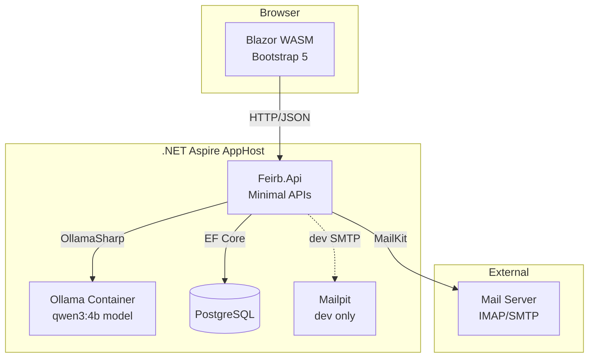

# Feirb — Architecture & Design

## Goals

- Provide a self-hosted mail client optimized for NAS systems
- Deliver a modern, responsive web UI for managing email
- Integrate local LLM capabilities for smart mail features
- Keep deployment simple: single command via Aspire, minimal external dependencies
- Support multiple mail accounts with IMAP/SMTP

## Non-Goals

- Not a replacement for Gmail/Outlook at scale — designed for personal/small team use
- No mobile-native apps (responsive web UI covers mobile use)
- No built-in mail server — connects to existing IMAP/SMTP servers
- No calendar or contacts integration (initial scope)

## System Architecture

## Components

### Feirb.AppHost

Aspire orchestration project and main entry point. Registers and configures all services, manages service discovery, and provides the Aspire dashboard.

Manages: PostgreSQL, Ollama (via `CommunityToolkit.Aspire.Hosting.Ollama`), Mailpit (dev).

### Feirb.ServiceDefaults

Shared service configuration: OpenTelemetry, health checks (`/health`, `/alive`), HTTP client resilience (Polly), service discovery.

### Feirb.Api

ASP.NET Core Minimal API backend. Connects frontend to mail servers, LLM, and database.

Endpoint groups: Mail, Folders, Settings, AI.

Key services: `IMailService` (MailKit IMAP/SMTP), `IAiService` (OllamaSharp), `IMailAccountService` (account management), `FeirbDbContext` (EF Core/PostgreSQL).

### Feirb.Web

Blazor WebAssembly standalone app. Communicates with API via typed `HttpClient` services. UI built with Bootstrap 5.

### Feirb.Shared

Shared library: DTOs (record types), interfaces, enums, route constants. Referenced by both API and Web.

## Technology Decisions

| Decision | Rationale |
|----------|-----------|
| **.NET Aspire** | Orchestrates multi-service topology, service discovery, dev dashboard, health monitoring |
| **Blazor WASM** | .NET end-to-end, shared types between frontend and backend, offline potential |
| **Minimal APIs** | Lightweight, less ceremony, fits the API surface well |
| **PostgreSQL** | Full-text search for mail, concurrent access, managed as Aspire container |
| **MailKit/MimeKit** | Gold standard for .NET mail — robust IMAP/SMTP, proper MIME handling |
| **OllamaSharp** | Typed .NET client for Ollama, streaming support, clean DI integration |
| **Bootstrap 5** | Proven, responsive, no build toolchain required |

## Security Considerations

- Mail passwords encrypted at rest via ASP.NET Data Protection API (keys persisted in volume)
- Passwords excluded from API responses and Aspire dashboard
- CORS restricted to Blazor WASM origin
- Rate limiting on AI endpoints
- HTML mail content sanitized before rendering
- AI runs locally via Ollama — no data leaves the NAS

## Future: Google Stitch / MCP Integration

*Details to be provided.* Planned integration with Google Stitch via Model Context Protocol (MCP). A `Stitch2Blazor` skill will be created for generating Blazor components from designs.
