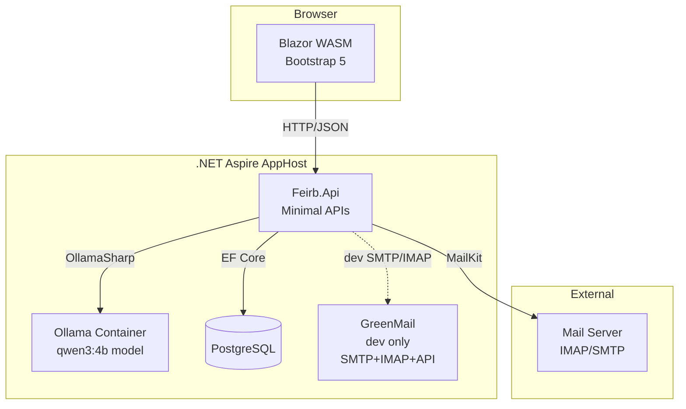

# Feirb — Architecture & Design

## Goals

- Provide a self-hosted mail client optimized for NAS systems
- Deliver a modern, responsive web UI for managing email
- Integrate local LLM capabilities for smart mail features
- Keep deployment simple: single command via Aspire, minimal external dependencies
- Support multiple mail accounts with IMAP/SMTP

## Non-Goals

- Not a replacement for Gmail/Outlook at scale — designed for personal/small team use
- No mobile-native apps (responsive web UI covers mobile use)
- No built-in mail server — connects to existing IMAP/SMTP servers
- No calendar or contacts integration (initial scope)

## Project Structure

```
mailclient/
├── src/
│   ├── Feirb.AppHost/          # Aspire orchestration (entry point)
│   ├── Feirb.ServiceDefaults/  # Shared service config (OpenTelemetry, health, resilience)
│   ├── Feirb.Api/              # ASP.NET Minimal API backend
│   │   ├── Data/               #   EF Core context, entities, migrations
│   │   ├── Endpoints/          #   Endpoint groups (Auth, Setup, Admin)
│   │   ├── Services/           #   Business logic services
│   │   └── Resources/          #   Localized API messages (.resx)
│   ├── Feirb.Web/              # Blazor WASM frontend
│   │   ├── Pages/              #   Routable pages (Login, Setup, Admin, etc.)
│   │   ├── Components/         #   Reusable UI components
│   │   ├── Services/           #   Typed HttpClient services
│   │   ├── Resources/          #   Localized UI strings (.resx)
│   │   └── Layout/             #   MainLayout, NavMenu, AuthLayout
│   └── Feirb.Shared/           # Shared DTOs, interfaces, enums
│       ├── Auth/               #   Auth request/response records
│       ├── Setup/              #   Setup DTOs
│       └── Admin/              #   Admin DTOs
├── tests/
│   ├── Feirb.Api.Tests/        # API unit & integration tests
│   └── Feirb.Web.Tests/        # Frontend tests
├── docs/                       # Project documentation
├── .claude/skills/             # Claude Code skill definitions
├── CLAUDE.md                   # Claude Code project instructions
└── Feirb.sln
```

## System Architecture



## Components

### Feirb.AppHost

Aspire orchestration project and main entry point. Registers and configures all services, manages service discovery, and provides the Aspire dashboard.

Manages: PostgreSQL (with pgAdmin), Ollama (via `CommunityToolkit.Aspire.Hosting.Ollama`), GreenMail (dev SMTP/IMAP/API).

### Feirb.ServiceDefaults

Shared service configuration: OpenTelemetry, health checks (`/health`, `/alive`), HTTP client resilience (Polly), service discovery.

### Feirb.Api

ASP.NET Core Minimal API backend. Connects frontend to mail servers, LLM, and database.

**Implemented endpoint groups:**
- **Auth** — Registration, login (JWT), token refresh, password reset
- **Setup** — Initial system setup (admin account + SMTP configuration)
- **Admin** — User management (CRUD, password reset)

**Planned endpoint groups:** Mail, Folders, Settings, AI (see [API Reference](API.md)).

**Key services:** `IAuthService`, `ISetupService`, `IUserManagementService`, `ISmtpTestService`, `FeirbDbContext` (EF Core/PostgreSQL).

### Feirb.Web

Blazor WebAssembly standalone app. Communicates with API via typed `HttpClient` services. UI built with Bootstrap 5.

**Implemented pages:** Login, Register, Password Reset, Setup Wizard, Admin User Management, placeholder navigation shell (Inbox, Sent, Drafts, Archive, Trash, Settings).

**Key components:** LanguageSwitcher, StepIndicator, SetupGuard, RedirectToLogin, MainLayout with sidebar navigation.

### Feirb.Shared

Shared library: DTOs (record types), interfaces, enums, route constants. Referenced by both API and Web.

## Data Model

### Current Schema

| Entity | Fields | Status |
|--------|--------|--------|
| **User** | Id, Username, Email, PasswordHash, RefreshToken, RefreshTokenExpiresAt, IsAdmin, CreatedAt, UpdatedAt | Implemented |
| **SmtpSettings** | Id, Host, Port, Username, EncryptedPassword, UseTls, RequiresAuth, CreatedAt, UpdatedAt | Implemented |
| **PasswordResetToken** | Id, UserId (FK→User), Token, ExpiresAt, IsUsed, CreatedAt | Implemented |

### Planned Entities

- **MailAccount** — Per-user IMAP/SMTP account configuration
- **CachedMessage** — Locally cached mail metadata and preview

## Technology Decisions

| Decision | Rationale |
|----------|-----------|
| **.NET Aspire** | Orchestrates multi-service topology, service discovery, dev dashboard, health monitoring |
| **Blazor WASM** | .NET end-to-end, shared types between frontend and backend, offline potential |
| **Minimal APIs** | Lightweight, less ceremony, fits the API surface well |
| **PostgreSQL** | Full-text search for mail, concurrent access, managed as Aspire container |
| **MailKit/MimeKit** | Gold standard for .NET mail — robust IMAP/SMTP, proper MIME handling |
| **OllamaSharp** | Typed .NET client for Ollama, streaming support, clean DI integration |
| **Bootstrap 5** | Proven, responsive, no build toolchain required |

## Internationalization (i18n)

- Default/neutral locale: `en-US`
- Supported locales: `de-DE`, `fr-FR`, `it-IT`
- Implementation: .NET resource files (`.resx`) + `IStringLocalizer<T>`
- Language detection: localStorage (`BlazorCulture`) → browser culture → `en-US` fallback
- API error messages respect `Accept-Language` header
- All auth, setup, and admin pages are fully localized

## Accessibility

- Target: WCAG 2.2 Level AA conformance
- Color contrast: minimum 4.5:1 (normal text), 3:1 (large text)
- Full keyboard navigation, visible focus indicators
- Semantic HTML with ARIA attributes where needed
- Automated testing via axe-core (planned)

## Security

- JWT authentication with refresh tokens
- Passwords hashed via BCrypt
- SMTP passwords encrypted at rest via ASP.NET Data Protection API (keys persisted in volume)
- Passwords excluded from API responses and Aspire dashboard
- CORS restricted to Blazor WASM origin
- Rate limiting on AI endpoints (planned)
- HTML mail content sanitized before rendering (planned)
- AI runs locally via Ollama — no data leaves the NAS

## Implementation Status

| Phase | Description | Status |
|-------|-------------|--------|
| Phase 0 | Foundation (Aspire, project structure) | Done |
| Phase 1 | Auth & User Management | Done |
| Phase 2 | System Setup & SMTP Configuration | Done |
| Phase 3 | Dashboard & Navigation Shell | Done (placeholder pages) |
| Phase 4 | Mail Fetching & Inbox | Not started |
| Phase 5 | Mail Compose & Send | Not started |
| Phase 6 | AI Features | Not started |
| Phase 7 | Quality & Compliance | Partial (i18n done, a11y/docs in progress) |

## Future: Google Stitch / MCP Integration

*Details to be provided.* Planned integration with Google Stitch via Model Context Protocol (MCP). A `Stitch2Blazor` skill will be created for generating Blazor components from designs.
